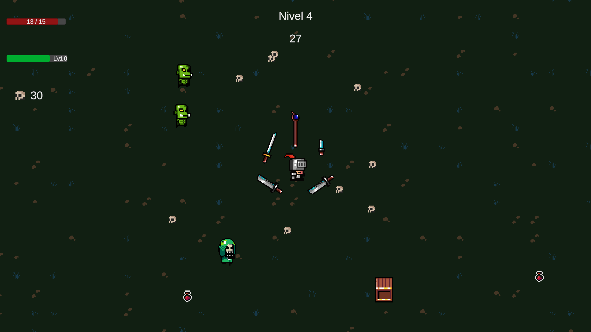

# 🗡️ Orc Attack

## 📖 **Description**
**Orc Attack** is a survival rogue-like game where you'll face hordes of enemies while collecting skulls to purchase upgrades. With dynamic and challenging gameplay, you'll need to enhance your skills and weapons to overcome increasingly difficult levels.

---

## 🎯 **Key Features**

- 🔄 **Progressive Level System** - Each level increases in duration and difficulty.
- ⚔️ **Dynamic Combat** - Engage enemies in both melee and ranged combat.
- 🛒 **Shop & Upgrade System** - Spend your collected skulls on new weapons and abilities.
- 📈 **Experience System** - Earn XP by eliminating enemies to unlock upgrades.
- 🎮 **Intuitive Controls** - Fluid movement and an automatic attack system.
- 🔊 **Comprehensive Audio System** - Adaptive music and immersive sound effects.
- 🎨 **Pixel Art Aesthetics** - Retro graphics with a roguelike style.

---

## 🚀 **Installation**
1. Download the [OrcAttack.zip](https://github.com/R4F405/Orc-attack/releases/tag/v1.0) file from the realeses.
2. Extract the contents of the ZIP file.
3. Run the included `.exe` file to start the game on Windows.

---

## 🎮 **Gameplay**

### Core Mechanics
- Survive enemy waves for a limited time per level.
- Collect skulls from defeated enemies to use as currency.
- After completing each level, access the upgrade panel and then the shop.
- Acquire up to 5 different weapons and multiple items with abilities.

### Progression
- Levels become longer and more challenging as you progress.
- The experience system allows you to unlock upgrades at each level.
- Combine ranged and melee weapons for an effective strategy.

### Sound System
- **Adaptive Music**:
  - Different tracks for each game scene.
  - Music transition system.
  - Customizable volume control.
- **Game Effects**:
  - Distinct sound when collecting skulls.
  - Auditory feedback when the player takes damage.
  - Special sound upon level completion.
  - Character footsteps when moving.
- **UI Sounds**:
  - Button clicks.
  - Successful purchase sound.
  - Error alert when an action cannot be performed.

---

## 🖼️ **Screenshots**

<!--### Main Menu
 -->

### Gameplay

---

## 🧩 **Detailed Features**

### Combat System
- **Ranged Weapons**:
  - Fire projectiles that automatically seek enemies.
  - Moderate damage with longer range.
  - Critical hit chance and life steal probability.

- **Melee Weapons**:
  - Attack in a close radius with higher damage.
  - Ability to hit multiple enemies at once.
  - Automatic rotation system towards the nearest enemy.

### Enemies
- **Melee Orcs**: Approach to attack directly.
- **Ranged Mages**: Launch projectiles from a distance.
- **Tanks**: Enemies with high resistance and enhanced damage.
- **Generative System**: Automated spawners that create progressive waves.

### Experience System
- Experience bar that fills up by eliminating enemies.
- Upon leveling up, access an upgrade panel with random options.
- Each subsequent level requires more experience than the previous one.

### Skills and Upgrades
- **Player Upgrades**:
  - Max health increase.
  - Reduced health recovery cooldown.
  - Collected skulls multiplier.

- **Weapon Upgrades**:
  - Increased general, melee, or ranged damage.
  - Increased critical hit chance.
  - Increased life steal probability.
  - Cooldown reduction.

- **Object Upgrades**:
  - Reduced box spawn time.

### Item System
- **Skulls**: Main in-game currency, dropped by enemies.
- **Boxes**: Destructible objects that can contain resources.
- **Health Potions**: Recover a percentage of the player's health.

---

## 🔧 **Technologies Used**
- **Engine**: Unity 6000.0.29f (functionality on other versions cannot be guaranteed)
- **Language**: C#
- **Graphics**: 2D sprites with a pixel art style
- **Audio**: Comprehensive audio system with music and effects
  - Global audio manager for centralized control.
  - Scene-based adaptive music system.
  - AudioSource/AudioClip components for localized effects.
  - Centralized system for UI sounds (GestorSonidosUI).
- **Documentation**: All scripts include comprehensive XML documentation
  - Standard C# XML comments (`///`) for classes, methods, and properties.
  - Parameter documentation with `<param>` and `<returns>` tags.
  - Detailed descriptions with `<remarks>` as needed.
  - Facilitates automatic documentation generation and IDE assistance.
  - Additionally, basic comments (`//`) are used for specific clarifications directly in the code.

---

## 🛠️ **Project Status**
The project is in active development with the following features already implemented:
- ✅ Complete level and wave system
- ✅ Functional shop with multiple upgrades
- ✅ Combat system with different weapon types
- ✅ Experience and progression system
- ✅ Adaptive music and sound effects system
- ✅ Navigation and pause menus
- ✅ Variety of enemies with different behaviors

Upcoming features:
- ⏳ More enemy types and final bosses
- ⏳ Game save system
- ⏳ Achievements and unlockables
- ⏳ New weapon types and abilities

---

## 🔢 **Controls**
- **WASD** or **Arrow Keys**: Character movement
- **ESC**: Pause menu
  - Access to options and sound settings
  - Return to the main menu
- **Left Mouse Click**: Interaction in menus and shop
  - Upgrade selection
  - Item purchase
  - Navigation through different panels

---

## 🙅 **Contributing**
External contributions are not accepted at this time.

---

## 📜 **License**
This project is licensed under the [GNU General Public License v3.0 (GPL-3.0)](LICENSE).

---

## 📬 **Contact**
For inquiries or potential collaborations, please reach out via the official GitHub repository (e.g., by opening an issue).

---

## 🎨 **Credits**

### - Development: R4F405

- **Art**:
  - [momongaa](https://momongaa.itch.io/roguelite-dungeon-tileset) - roguelite-dungeon-tileset
  - [Free Game Assets GUI, Sprite, Tilesets](https://free-game-assets.itch.io/48-free-rpg-loot-icons-pixel-art) - 48-free-rpg-loot-icons-pixel-art
  - [Seth](https://sethbb.itch.io/32rogues) - 32rogues
  - [Emma](https://enma1890.itch.io/throwknight) - throwknight
  - [BDragon1727](https://bdragon1727.itch.io/fire-pixel-bullet-16x16) - fire-pixel-bullet-16x16

- **Sound Effects and Music**: Refer to the [Assets/Credits.txt](Assets/Creditos.txt) file for a complete list of attributions.
